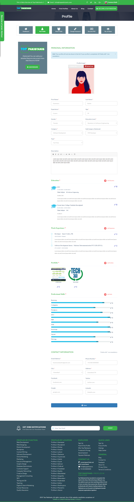
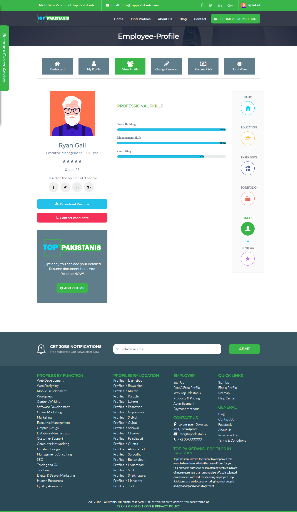
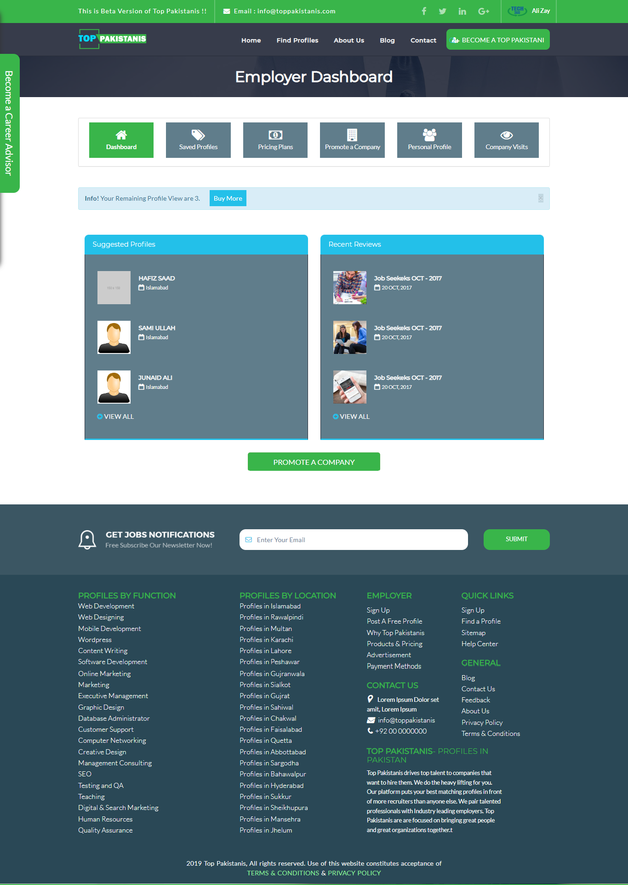
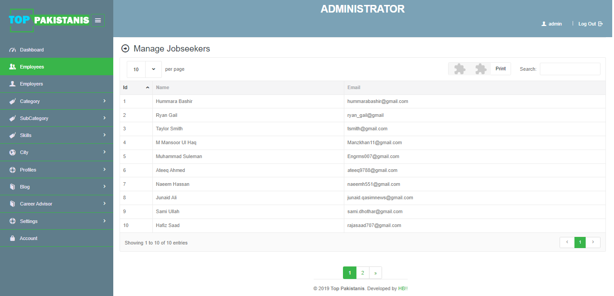

 

 

<h2>🗣️ About this project</h2>

Top Pakistanis is a CodeIgniter & MySQL Web Application designed to serve as a job board. Key features include user registration and authentication, a user-friendly interface for job seekers to create and edit their resumes, and the ability to download resumes in PDF format. Recruiters will have access to a dashboard where they can post job openings, manage applications, and search for potential candidates based on specific criteria. The application also incorporate a search functionality, enabling users to find relevant jobs or candidates quickly.

<ul>
  <li>Advanced search functionality</li>
  <li>Job seeker Profile Views</li>
  <li>Employer Dashboard</li>
  <li>Admin and SuperAdmin Dashboards</li>
  <li>Reviews and Ratings</li>
  <li>Pricing Plans to upgrade profile</li>
  <li>Create, Update and Download Resume</li>
  <li>Blogs Posting</li>
  <li>Password encryption using MD5</li>
</ul>

 

<table>
  <tr>
    <td valign="top"></td>
    <td valign="top"></td>
    </tr>
</table>
<table>
  <tr>
    <td valign="top"></td>
    <td valign="top"></td>
    <td valign="top"></td>
    <td valign="top"></td>
  </tr>
</table>
<table>
  <tr>
    <td valign="top"></td>
    <td valign="top"></td>
    <td valign="top"></td>
    <td valign="top"></td>
  </tr>
</table>
<table>
  <tr>
    <td valign="top"></td>
    <td valign="top"></td>
    <td valign="top"></td>
    <td valign="top"></td>
  </tr>
</table>
<table>
  <tr>
    <td valign="top"></td>
    <td valign="top"></td>
    <td valign="top"></td>
    <td valign="top"></td>
  </tr>
</table>

